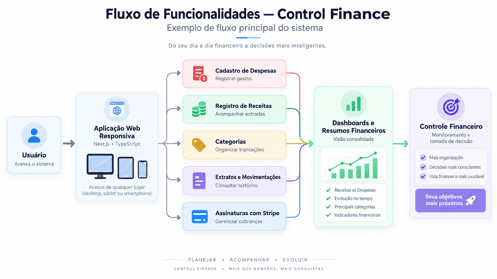

# 💰 Control Finance

Aplicação web de **controle financeiro** desenvolvida com **Next.js e TypeScript**, voltada ao gerenciamento de despesas, receitas e assinaturas.

O projeto reúne uma interface moderna e responsiva com funcionalidades para acompanhamento financeiro e integração com **Stripe**.

---

## 🚀 Sobre o Projeto

O **Control Finance** permite organizar e acompanhar informações financeiras em uma única aplicação.

Entre as principais funcionalidades estão:

- 💸 Cadastro e gerenciamento de despesas
- 💰 Registro e acompanhamento de receitas
- 📊 Visualização de dashboards e resumos financeiros
- 🗂️ Organização de transações por categorias
- 📄 Consulta de extratos e movimentações
- 💳 Gerenciamento de assinaturas com Stripe
- 📱 Interface responsiva para diferentes dispositivos

---

## 🔄 Exemplo de Fluxo

  

---

## 🛠️ Tecnologias Utilizadas

### Desenvolvimento

`Next.js 14` `TypeScript` `React`

### Estado e Interface

`React Hooks` `Context API`

### Pagamentos

`Stripe API`

### Qualidade de Código

`ESLint` `Prettier` `Husky`

### Versionamento

`Git` `GitHub`

---

## ⚙️ Qualidade e Padronização

O projeto utiliza ferramentas voltadas à manutenção da qualidade e padronização do código:

- **ESLint** para análise estática
- **Prettier** para formatação
- **Husky** para execução de Git hooks antes dos commits

Essas ferramentas ajudam a manter o código consistente durante o desenvolvimento.

---

## 💳 Integração com Stripe

A aplicação utiliza a **Stripe API** para trabalhar com funcionalidades relacionadas a assinaturas e pagamentos.

Essa integração permite explorar conceitos como:

- integração com APIs externas;
- gerenciamento de assinaturas;
- processamento de informações de pagamento;
- comunicação entre aplicação e serviços de terceiros.

---

## 📚 Conceitos Aplicados

Este projeto envolve conhecimentos em:

`Next.js` • `TypeScript` • `React` • `API Integration` • `Stripe` • `Responsive Design` • `Git Hooks` • `Code Quality`

---

## 🎓 Contexto do Projeto

Projeto desenvolvido durante o **Full Stack Club**, como parte do processo de aprendizado e prática em desenvolvimento web Full Stack.

Conteúdo ministrado por:

**Felipe Rocha**  
🔗 [GitHub](https://github.com/felipemotarocha)

---

## 👩‍💻 Desenvolvedora

**Lara Santos Pereira Soares**

💼 [LinkedIn](https://www.linkedin.com/in/lara-santos-668a97326/)  
🐙 [GitHub](https://github.com/lara-softdeveloper)

---

⭐ Se este projeto foi interessante, considere deixar uma **Star** no repositório.
